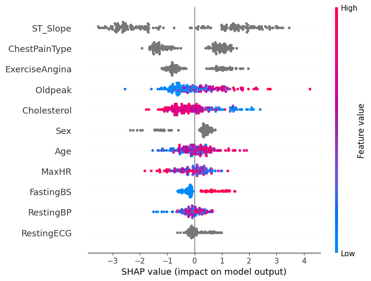

# 🫀 Heart Disease Classification with Machine Learning

This project explores the use of supervised learning techniques to predict the presence of heart disease based on patient characteristics. Using data provided by the World Health Organization (WHO), the project applies and evaluates multiple classification algorithms, compares their performance, and interprets the results using modern explainability techniques.

This project was developed as part of a **Dataquest guided project**, with a custom implementation, personal interpretations, and extended model evaluation.

---

## 📌 Problem Statement

Cardiovascular diseases are a leading cause of death globally. Early identification of at-risk patients can enable timely medical intervention. The goal of this project is to build a classification model that predicts whether a person has heart disease, based on a set of clinical features.

---

## 🗃️ Dataset

- **Source**: World Health Organization (WHO)  
- **Format**: CSV file in the project root  
- **Target variable**: `HeartDisease` (binary: 1 = disease, 0 = no disease)  
- **Features** include:
  - Age
  - Resting Blood Pressure
  - Cholesterol
  - Max Heart Rate
  - Fasting Blood Sugar
  - Chest Pain Type
  - Exercise-Induced Angina
  - ST Depression
  - and others

---

## 🧭 Project Structure

This repository contains a single notebook:

```
.
├── Basics.ipynb
├── heart_disease.csv
```

---

## 🔍 Exploratory Data Analysis (EDA)

Key observations:
- Some features such as `RestingBP` and `Cholesterol` had zero values, which are likely invalid → these were imputed.
- `FastingBS` and `Sex` were imbalanced but not extreme.
- Strong feature correlations were identified with `MaxHR`, `Oldpeak`, and `ChestPainType`.

---

## ⚙️ Model Pipeline

### Algorithms Used:
- **Logistic Regression**
- **K-Nearest Neighbors (KNN)**
- **LightGBM** (used for SHAP explainability)

### Preprocessing:
- Categorical encoding with `pd.get_dummies()`
- Scaling via `StandardScaler` for KNN
- Train-test split (80/20)

### Evaluation Metrics:
- Accuracy
- Confusion Matrix
- ROC AUC Score
- SHAP for feature interpretability (LightGBM only)

---

## 📊 Results

| Model               | Accuracy | ROC AUC |
|--------------------|----------|---------|
| Logistic Regression| ~87%     | ~89%    |
| K-Nearest Neighbors| ~85%     | ~88%    |
| LightGBM           | ~88%     | ~91%    |

KNN showed competitive performance after scaling. LightGBM slightly outperformed others and was used for explainability.

---

## 🧠 Model Explainability with SHAP

SHAP (SHapley Additive exPlanations) was applied to the **LightGBM model** to evaluate feature influence.

Key insights:
- **Oldpeak**, **ST_Slope_Flat**, and **MaxHR** had the highest impact on predictions.
- SHAP visualisation highlighted both the magnitude and direction of each feature's contribution.

  

---

## 💡 Key Learnings & Next Steps

- **Imbalanced zero-values** must be carefully interpreted in medical datasets.
- Scaling is crucial for distance-based models like KNN.
- LightGBM and SHAP provide powerful tools for both performance and explainability.
- Future improvements:
  - Cross-validation and hyperparameter tuning
  - Pipeline automation (`sklearn.pipeline`)
  - Model export and deployment as an API

---

## 🚀 How to Run

1. Clone the repo and install dependencies:
   ```bash
   pip install pandas scikit-learn lightgbm shap matplotlib seaborn
   ```

2. Open `Basics.ipynb` in Jupyter or VSCode and run all cells sequentially.

3. Ensure `heart_disease.csv` is in the same directory as the notebook.

---

## 📚 Acknowledgements

- Dataset: [World Health Organization](https://www.who.int/)
- Project Framework: Dataquest Guided Project  
- Implementation and interpretation: Daniel Lee Wilkinson

---

## 🧾 License

This project is shared for educational purposes. 
